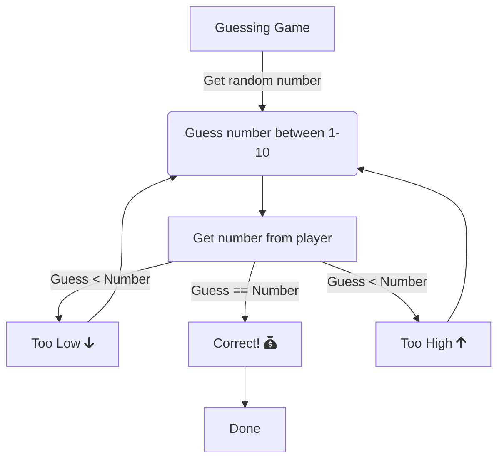

```mermaid
flowchart TD
    A[Guessing Game] -->|Get random number| B(Guess number between 1-10)
    B --> C[Get number from player]
    C -->|Guess < Number| D[Too Low fa:fa-arrow-down] --> B
    C -->|Guess == Number| E[Correct! fa:fa-sack-dollar] --> G[Done]
    C -->|Guess < Number| F[Too High fa:fa-arrow-up] --> B
```
